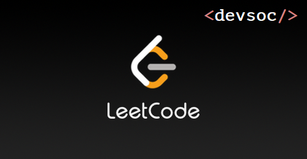
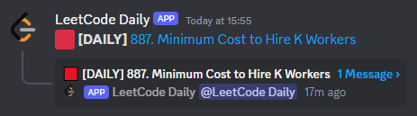

<p align="center">
  
</p>

# LeetCode Daily Discord Bot
Discord bot to ping users daily to do the LeetCode Daily Problem. Originally built for the 2024 DevSoc Internal Team Discord.

You add invite bot to your server with [this link](https://discord.com/oauth2/authorize?client_id=1238418095597551646).

<p align="center">
  
</p>

## Setup Instructions
**Requirements:**
- Node/NVM
- `pnpm` (installed with `npm i -g pnpm`)

This program was built using `node` version 21+ and `pnmp` version 8+, but any recent versions should be fine.

### Installation
Clone the repository and install dependencies:

```bash
git clone git@github.com:jeremyle56/sleep-bot.git
cd leetcode-daily-bot
pnpm install
```

In the root director create a file `.env` with the following environment variables:
- `DISCORD_TOKEN` - The token of the bot

```bash
echo "TOKEN=<token>" > .env
```

Your `.env` file should look like this:
```bash
TOKEN=OTk1MTU1NzcyMzYxMTQ2NDM4.AFAFAW.AgawAWgbaeW8FAFWAW8gwgwg15wgwWA8A08G56FA
```

Once you have invited your bot to the server ensure that you have a text channel called `coding-challenges` and role `LeetCode Daily`.

If you would like to use the GitHub Action to schedule a cron job to post the daily problem to the channel, ensure that you add the `TOKEN` secret to your GitHub repository.

### Running the Bot
There are two way we can run the bot. One of them will be helpful for development while the other is for production.

While developing we can run:
```bash
pnpm run dev
```

to start the bot. This uses `tsx watch` so will restart the bot everytime there is a file save that impact `src/index.ts`.

Alternatively for quicker run times in production we can run 
```bash
pnpm run build && pnpm run start
```

This will transpile our TypeScript code into JavaScript files and run the bot. JavaScript files run faster as TypeScript is only useful as a development dependancy.

## Feedback
If you have any feature suggestions, feedback or issues feel free to add them to the `issues` tab of the project repository.

This bot is in no way affiliated with LeetCode or any other company. It is a personal project that I built in my spare time.
